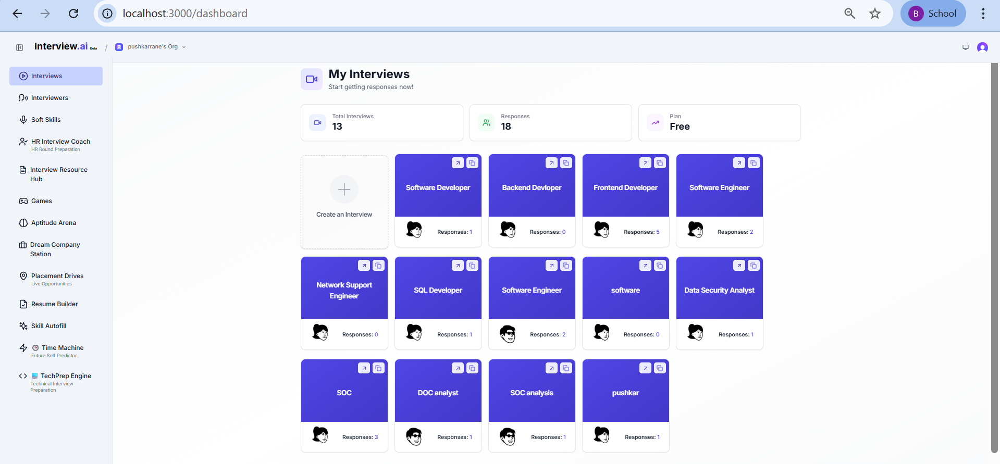
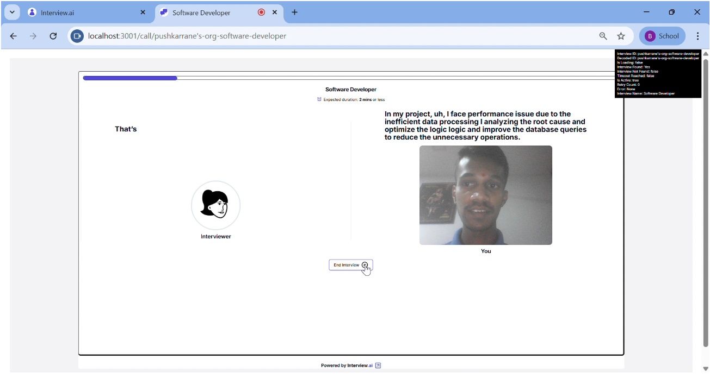
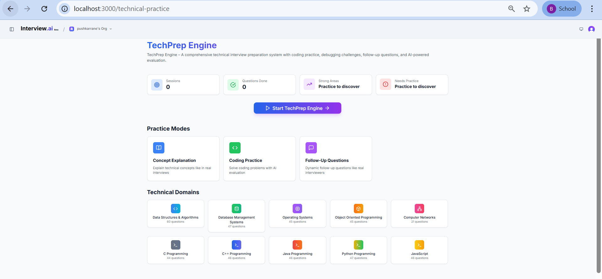
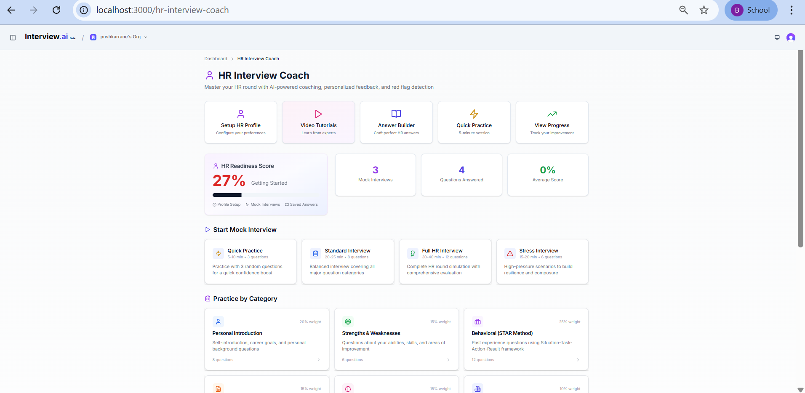

# Slide 4 - List of Features Offered by the Solution

---

## List of features offered by the solution

---

1. **AI Mock Interview Engine** — Real-time voice-enabled interviews with GPT-4o, adaptive follow-up questions, and detailed scoring & feedback

2. **TechPrep Engine** — Domain-specific technical practice for DSA, DBMS, OS, OOP, Computer Networks with multiple difficulty levels

3. **Aptitude Arena** — Timed practice tests for Quantitative Aptitude, Logical Reasoning, and Verbal Ability with step-by-step solutions

4. **HR Interview Coach** — Behavioral interview simulation with facial expression analysis, sentiment detection, and STAR method evaluation

5. **Resume Builder** — ATS-friendly resume creation with AI-powered skill extraction using OCR (Tesseract.js) and professional PDF export

6. **Dream Company Station** — Company-specific preparation modules for TCS, Infosys, Wipro, Accenture, Capgemini, Cognizant with previous year questions

7. **AI Question Generation** — Context-aware questions generated based on resume skills, selected topics, difficulty level, and previous responses

8. **Smart Analytics Dashboard** — Performance trends, topic-wise proficiency charts, interview readiness score, and weak area identification

9. **Gamified Learning** — Quiz games, coding challenges, leaderboards, daily challenges, and achievement badges for engaging preparation

10. **Progress Tracking (Time Machine)** — Historical performance data, skill improvement trends, activity heatmap, and personalized insights

---

### Screenshots:

| Feature | Preview |
|---------|---------|
| Dashboard |  |
| AI Interview |  |
| TechPrep |  |
| Aptitude |  |
| HR Coach |  |
| Resume Builder |  |
