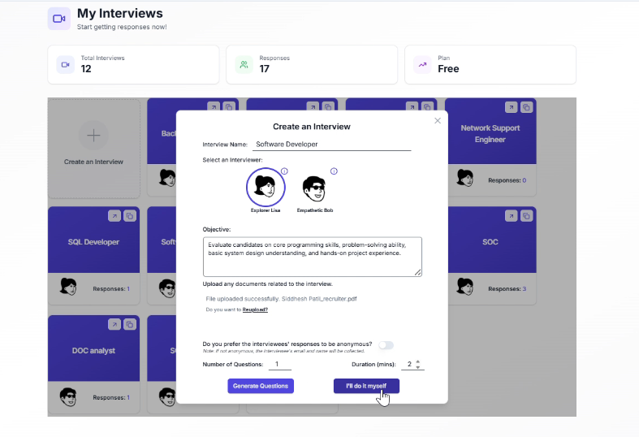
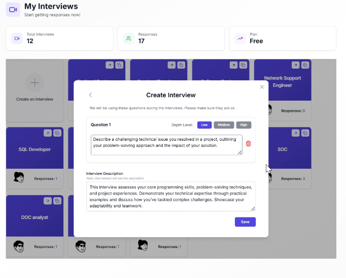
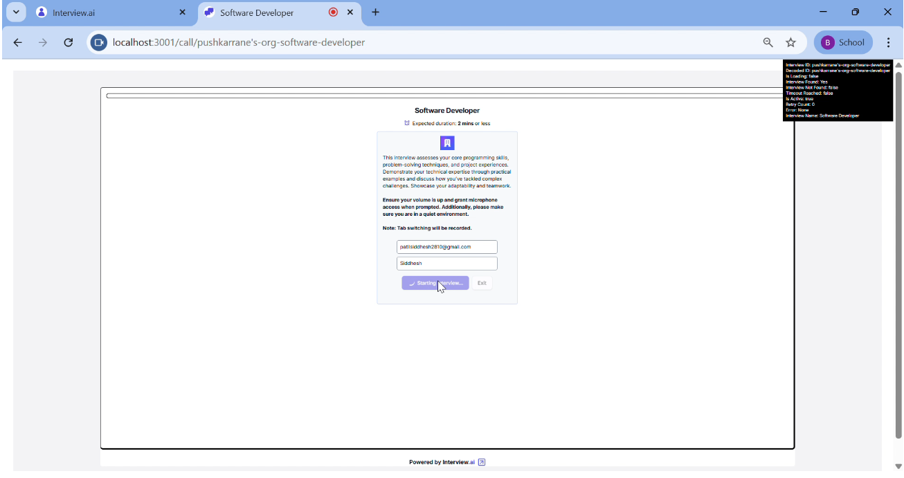
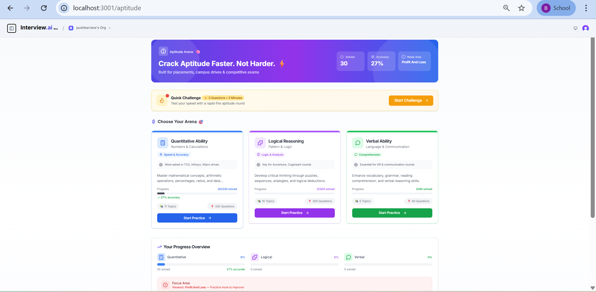
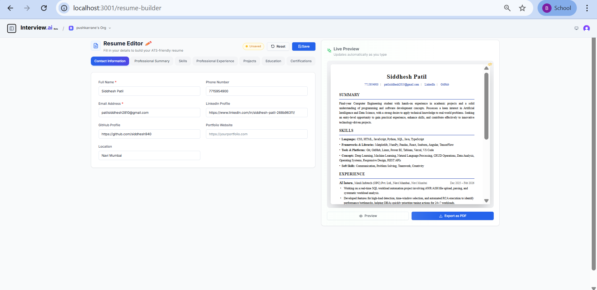
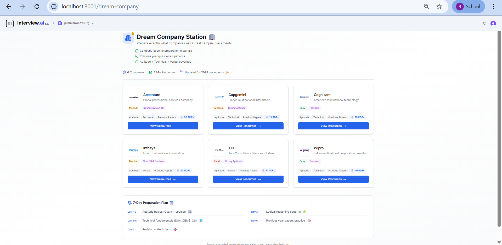

# Chapter 8 - Result Analysis

## 8.1 Result Analysis

This chapter presents the result analysis of the Interview.ai platform by showcasing the implemented system's key screens and functionalities. The results validate that all functional requirements are met and the system delivers a seamless, AI-driven interview preparation experience.

---

### 1. Dashboard

*Figure 8.1.1: Dashboard*

In Fig 8.1.1 illustrates the Dashboard page which serves as the central hub after user login. It displays all created interviews with their status, response counts, subscription plan details, and quick-access cards for creating new interviews.

---

### 2. Create Interview

*Figure 8.1.2: Create Interview Page*

In Fig 8.1.2, the Create Interview page allows users to configure new AI interview sessions by specifying the job role, interview name, description, AI interviewer persona, and difficulty level. On submission, a unique interview URL is generated and saved to the database.

---

### 3. AI Question Generation

*Figure 8.1.3: AI Question Generation*

In Fig 8.1.3, the AI Question Generation module dynamically generates role-specific interview questions using OpenAI GPT-4o based on job role, difficulty, and topic configuration. Users can review, edit, or regenerate the questions before finalizing.

---

### 4. Software Start Interview

*Figure 8.1.4: Interview Start Page*

In Fig 8.1.4, the Interview Start page displays interview details, instructions, and checks microphone/camera permissions before the candidate begins the AI interview session.

---

### 5. Live AI Interview Call

*Figure 8.1.5: Live AI Interview Call*

In Fig 8.1.5, the Live AI Interview Call is the platform's flagship feature — real-time voice interview using Retell AI. The AI interviewer asks questions, listens to responses, and adapts follow-ups dynamically. Post-call, a detailed performance analysis with scores and feedback is generated.

---

### 6. Technical Practice Engine

*Figure 8.1.6: Technical Practice Engine*

In Fig 8.1.6, the Technical Practice Engine supports 10 domains (DSA, DBMS, OS, OOP, CN, C, C++, Java, Python, JavaScript) with 400+ questions. It offers three practice modes: Concept Explanation, Coding Practice, and Follow-Up Questions.

---

### 7. Aptitude Arena

*Figure 8.1.7: Aptitude Arena*

In Fig 8.1.7, the Aptitude Arena offers timed practice for quantitative aptitude, logical reasoning, and verbal ability with instant feedback and performance analytics for campus placement preparation.

---

### 8. HR Interview Coach

*Figure 8.1.8: HR Interview Coach*

In Fig 8.1.8, the HR Interview Coach provides AI-powered preparation for HR rounds covering common questions like "Tell me about yourself" and "Why should we hire you?". The AI evaluates answers for clarity, confidence, and communication skills.

---

### 9. Resume Builder

*Figure 8.1.9: Resume Builder*

In Fig 8.1.9, the Resume Builder enables users to create professional resumes with multiple templates, real-time preview, and PDF export. Resume data is stored securely in Supabase PostgreSQL.

---

### 10. Dream Company Station

*Figure 8.1.10: Dream Company Station*

In Fig 8.1.10, the Dream Company Station provides company-specific preparation for Accenture, Capgemini, Cognizant, Infosys, and TCS with aptitude papers, technical questions, and previous year interview papers.
